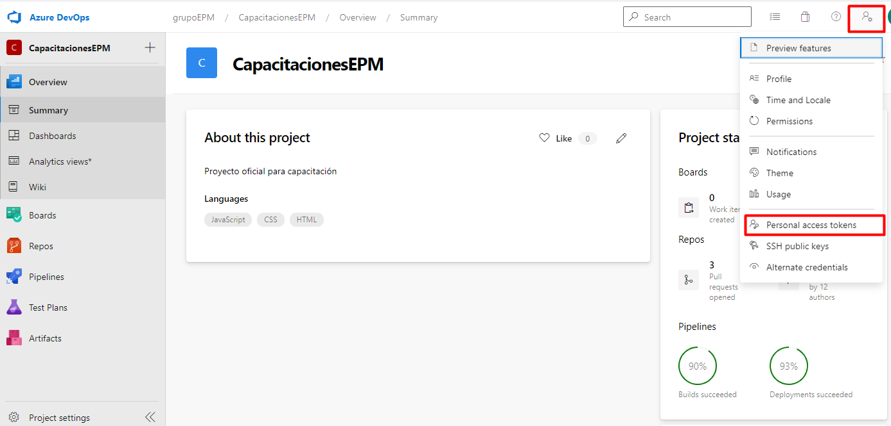
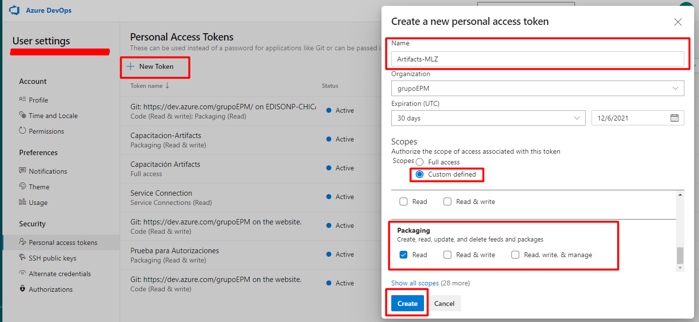

Hasta el momento solo se han usado librerías Nuget que están publicadas en el repositorio oficial. Ahora procederá a utilizar una librería que está publicada en un feed de Artifacts en un proyecto privado de Azure DevOps.

En este momento, intentará agregar la dependencia **EPM-Saludo 1.0.0-CI-20210513-205338**, la cual está publicada desde el proyecto de CapacitacionesEPM en un feed de Artifacts https://grupoepm.visualstudio.com/CapacitacionesEPM Antes de continuar, valide que tenga acceso a la URL estando logueado con su cuenta laboral o de contratista. En caso de que no pueda acceder, por favor establezca comunicación con alguna persona de la mesa DevOps para que lo agregue al proyecto y pueda llevar a cabo su práctica.

Ejecuta el siguiente comando para intentar agregar la dependencia `dotnet add package EPM-Saludo --version 1.0.0-CI-20210513-205338`{{execute}}

Como se puede dar cuenta no fue posible encontrar la dependencia EPM-Saludo, el motivo es porque dotnet intenta buscar en el repositorio oficial de Nuget por defecto.

Ejecuta el siguiente comando para ver cuáles fuentes de repositorio Nuget están configurados `dotnet nuget list source`{{execute}} y confirmará lo dicho anteriormente.

Para configurar las fuentes de las dependencias de Nuget que se utilizarán en el proyecto, vamos a crear un archivo nuget.config en la misma ruta donde tenemos el .csproj.

`touch nuget.config`{{execute}}

Con la ayuda del editor, copia las siguientes líneas de código en el archivo nuget.config. Tenga cuidado de no dejar la primera línea vacía, a veces suele suceder.

```
<?xml version="1.0" encoding="utf-8"?>
<configuration>
  <packageSources>
    <clear />
    <add key="org-epm-artefactos" value="https://grupoepm.pkgs.visualstudio.com/_packaging/org-epm-artefactos/nuget/v3/index.json" />
  </packageSources>
  <packageSourceCredentials>
    <katacoda>
      <add key="Username" value="cualquiercosa" />
      <add key="ClearTextPassword" value="%VSS_NUGET_EXTERNAL_FEED_ENDPOINTS%" />
    </katacoda>
</packageSourceCredentials>
</configuration>
```{{copy}}

Si analiza detenidamente, en el archivo nuget.config en la etiqueta ClearTextPassword debemos colocar el personal access token de Azure DevOps, que debería tener al menos permisos de lectura en el feed de Artifacts. Para este paso es necesario que usted genere el token, y para realizar este paso usted debera de dirigirse a https://grupoepm.visualstudio.com/CapacitacionesEPM e ingresar al menú de las configuraciones



Ahora el siguiente paso a seguir es crear el token. Entonces, deberá de seleccionar la opción New Token y para nombrarlo deberá de seguir el lineamiento Artifacts-<Inciales de su nombre>, por ejemplo:Si la usuaria se llama Milena López Zapata, su token deberá de llamarse: Artifacts-MLZ. Seleccionar en Scoopes la opción Custom defined, buscar la opción Packaging y seleccionar la opción Read. Para generar el token seleccione por último el botón de crear:



Después se abrirá una ventana al lado derecho de su pantalla, copie el token y péguelo en un sitio que sea seguro para usted (block de notas) Tenga en cuenta que este código por temas de seguridad solamente podrá obtenerlo por una vez.


Regrese a la consola de este ejercicio, y copie el siguiente comando teniendo en cuenta el token que generó en el paso anterior en Azure DevOps:

`export VSS_NUGET_EXTERNAL_FEED_ENDPOINTS=<copia acá el token que generó en los pasos anteriores>`{{copy}}

Para verificar la acción anterior puedes ejecutar el siguiente comando `printenv VSS_NUGET_EXTERNAL_FEED_ENDPOINTS`{{execute}}

## Nota

La configuración de packageSourceCredentials quizás no sea necesaria en los proyectos reales en los que estés trabajando, ya que los pipelines de Azure DevOps y Visual Studio pueden manejar de manera transparente la autenticación de los repositorios.