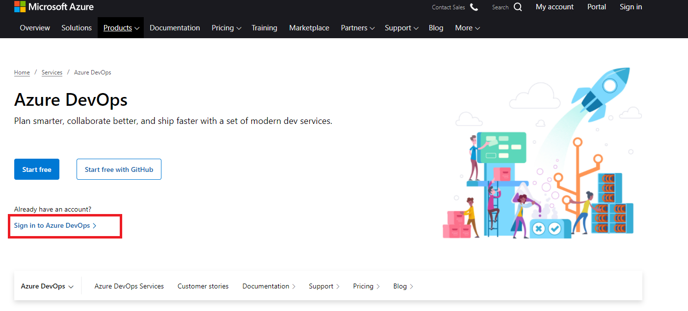
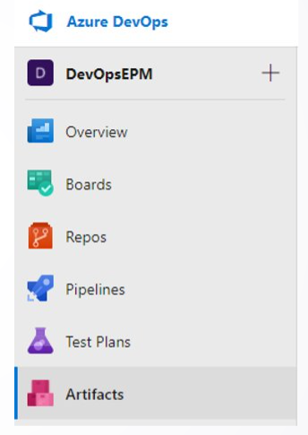

Antes de iniciar con la práctica se requiere tener una organización en Azure DevOps para realizar estas pruebas. **Por ningún motivo, se recomienda utilizar la organización oficial de su compañía.** En caso que no tenga una organización de Azure DevOps propia, proceda a realizar los siguientes pasos:

Ingresar al sitio: https://azure.microsoft.com/en-us/services/devops/

Dentro de la organización que tiene para realizar las pruebas, deberá crear un proyecto y la visibilidad debe de ser privado.

Una vez creado el proyecto, proceda a ingresar al módulo artifacts que está al lado izquierdo de su pantalla

Luego, debe de crear un feed con alcance de proyecto

Tenga en cuenta seguir los lineamientos definidos en el punto uno del procedimiento "Crear un feed con alcance de proyecto" para feeds con alcance de proyecto. Este documento está alojado Sharepoint y puede solicitarlo a quién está acompañando la actividad

En la creación del feed tenga en cuenta los siguientes lineamientos:

    - Nombre del feed: <nombre del proyecto>-artifacts
    - Visibility: Specific people
    - Deshabilitar la opción: Upstream sources
    - Scope: seleccionar la opción en donde aparece el nombre de su proyecto

