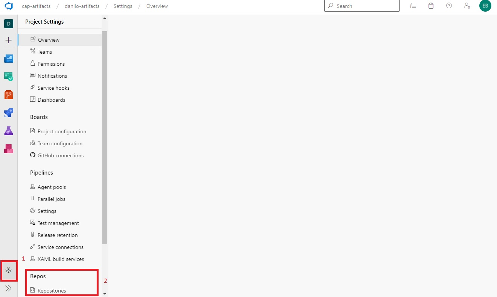

Para esta práctica, deberá seguir los siguientes pasos:

Ingresar al sitio: https://azure.microsoft.com/en-us/services/devops/

Antes de iniciar con la práctica se requiere tener una organización en Azure DevOps para realizar estas pruebas. No se recomienda utilizar la organización oficial de su compañía

Dentro de la organización que tiene para realizar las pruebas, deberá crear un proyecto y la visibilidad debe de ser privado.

Ingresar al módulo artifacts y crear un feed con alcance de proyecto siguiendo los lineamientos definidos en el punto uno del procedimiento "Crear un feed con alcance de proyecto". En este documento se requiere cumplir los siguientes lineamientos:

    - Nombre del feed: <nombre del proyecto>-artifacts
    - Visibility: Specific people
    - Deshabilitar la opción: Upstream sources
    - Scope: seleccionar la opción en donde aparece el nombre de su proyecto

