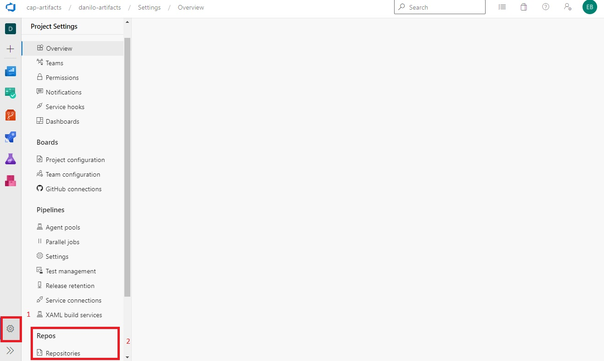

Para esta práctica, se necesita crear un repositorio git en el proyecto. Para ello deberá seguir los siguientes pasos:

Ingresar a la configuración del proyecto y luego a la opción Repositories

Seleccinar la opción Create.

Para crear el repositorio, tenga en cuenta las siguientes recomendaciones
    - Repository name:universal 
    - Check en Add a README

Seleccionar Create para terminar con la tarea de crear el repositorios