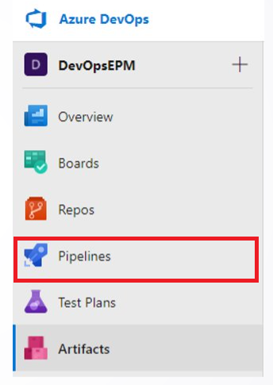

Ahora se realizará la publicación del paquete que está alojado en el repositorio del paso anterior. Para esta actividad, nos apoyaremos en las tareas del pipeline CI y se debe con la continuación de los siguientes pasos:

Ingresar al módulo de Azure Pipelines y crear un nuevo Pipeline

Luego de ingresar a la opción de pipelines, deberá usar el editor clásico 

Seleccionar el origen del repositorio que creó en el paso anterior:
    - Select a source: Azure Repos Git
    - Team project: epm-artifacts
    - Repository: universal

En el paso siguiente escoger la opción Empty Job

El pipeline debe de configurarse con un agente alojado en Azure.

Agregar la tarea Universal packages del menú de tareas y realizar las siguientes configuraciones.

Proceda a guardar las configuraciones y ejecute el pipeline.

Una vez termine de ejecutarse el pipeline ingrese al módulo de Artifacts, seleccione el feed correspondiente y allí encontrará el paquete publicado desde el pipeline de build.

**Finalizando esta actividad, usted ha logrado publicar un paquete universal en Azure Artifacts.**