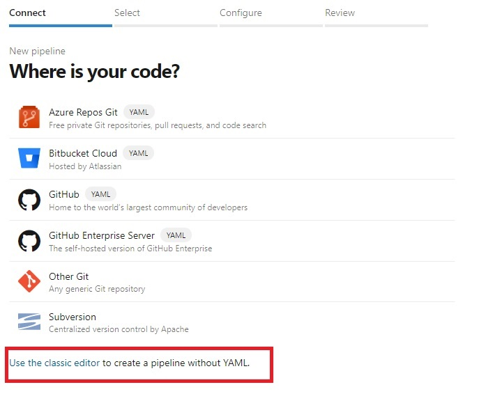
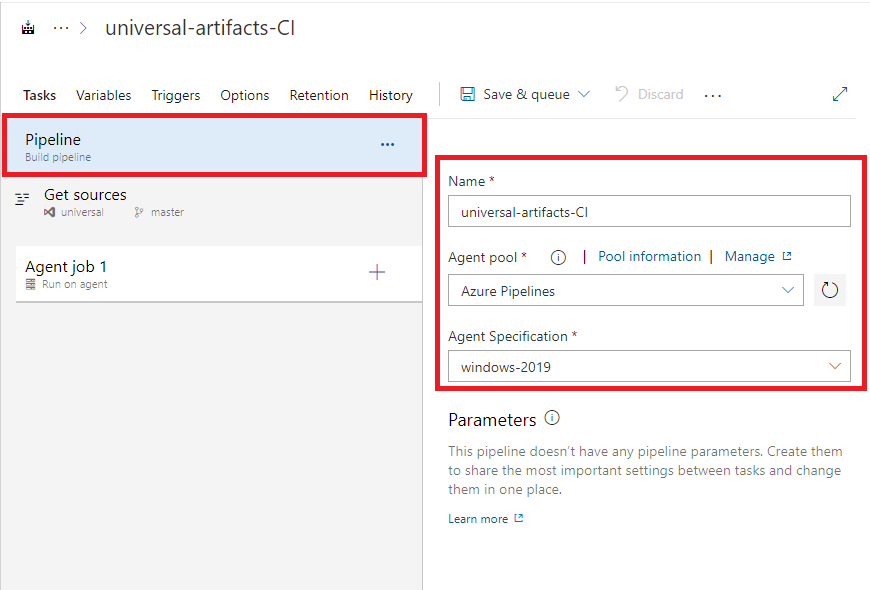
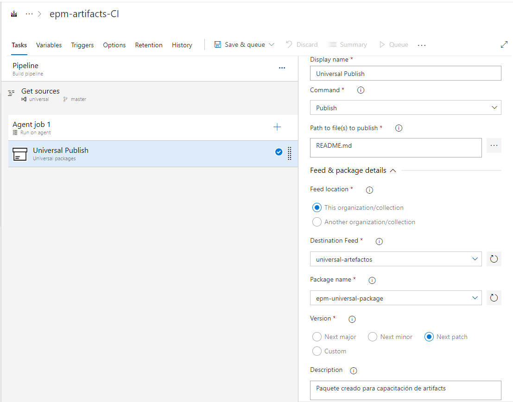

Para la configuración del pipeline de CI, debe de seguir los siguientes pasos

Ingresar al módulo de Azure Pipelines y crear un nuevo Pipeline

Para configurar el pipeline de esta práctica, deberá usar el editor clásico 

Seleccionar el origen del repositorio que creó en el paso anterior:
    - Select a source: Azure Repos Git
    - Team project: epm-artifacts
    - Repository: universal

En el paso siguiente escoger la opción Empty Job

El pipeline debe de configurarse con un agente alojado en Azure.

Agregar la tarea Universal packages del menú de tareas y realizar las siguientes configuraciones.

Proceda a guardar las configuraciones y ejecute el pipeline.

Una vez termine de ejecutarse el pipeline ingrese al módulo de Artifacts, seleccione el feed correspondiente y allí encontrará el paquete publicado desde el pipeline de build.
