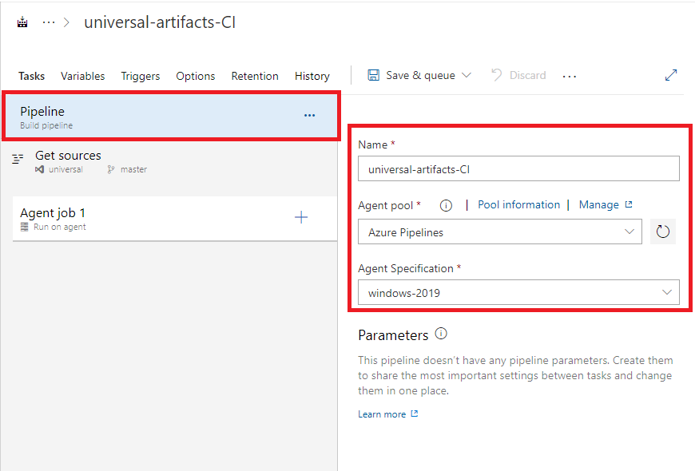

5. El pipeline debe de configurarse con un agente alojado en Azure.

6. Agregar la tarea Univiersal packages del menú de tareas y realizar las siguientes configuraciones.

7. Proceda a guardar las configuraciones y ejecute el pipeline.

8. Una vez termine de ejecutarse el pipeline ingrese al módulo de Artifacts, seleccione el feed universal-artifracts y allí encontrará el paquete publicado