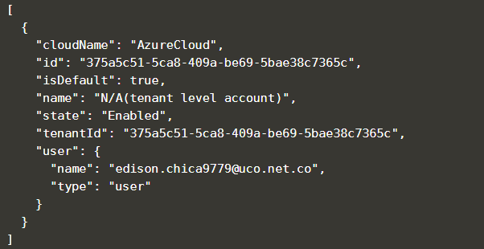

Ahora necesita iniciar sesion en Azure, para esto siga las siguientes indicaciones

En la terminal de comandos, ingrese `az login`, para este ejercico utilizaremos una máquina virtual alojada en un repositorio remoto, por eso deberá usar el comando `az login --allow-no-subscription`{{execute}}. Este comando habilita la CLI sin necesidad de estar logueado

En la terminal, el sistema le dará como respuesta una línea con link para ingresar a la página https://microsoft.com/devicelogin con un token en mayúsculas con el que deberá loguearse.

Seleccionar la cuenta de Azure DevOps donde realizó los pasos anteriores. Para verificar el éxito de esta operación, en la terminal deberá de obtener un resultado similar a este

