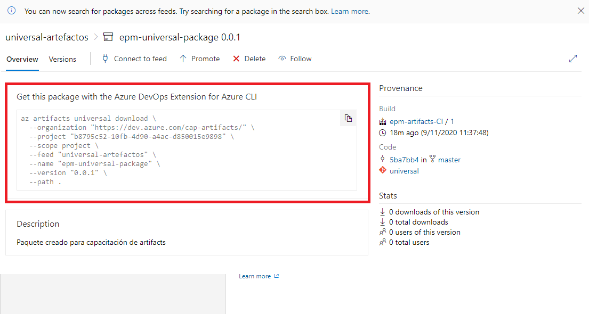
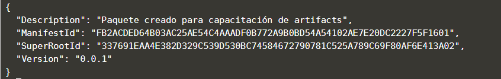

Para descargar el paquete universal,debe ingresar al feed donde lo almacenó y seleccionarlo. Una vez lo seleccione, le aparecerá un código similar a este:

Copielo y péguelo usando shitf + insert en la terminal y proceda a ejecutarlo.

Una vez ejecutado, puede probar que su descarga se realizó verificando en la terminal un mensaje similar a este:

Además puede revisar el paquete descargado utilizando el comando ls -a