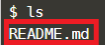

Para descargar el paquete universal publicado en los pasos anteriores,debe ingresar al feed donde lo almacenó y seleccionar el artefacto. Una vez seleccionado, le aparecerá un código similar a este:

Copielo y péguelo usando shitf + insert en la terminal de esta ventana y proceda a ejecutarlo.

Una vez ejecutado, puede probar que su descarga se realizó verificando en la terminal un mensaje similar a este:

Además puede revisar el paquete descargado utilizando el comando `ls`{{execute}} y encontrará el nombre del archivo README.md

**Finalizando esta actividad, usted ha logrado descargar un paquete universal de Azure Artifacts.**