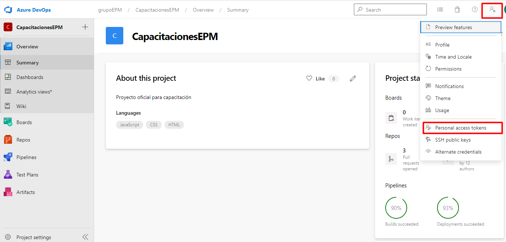
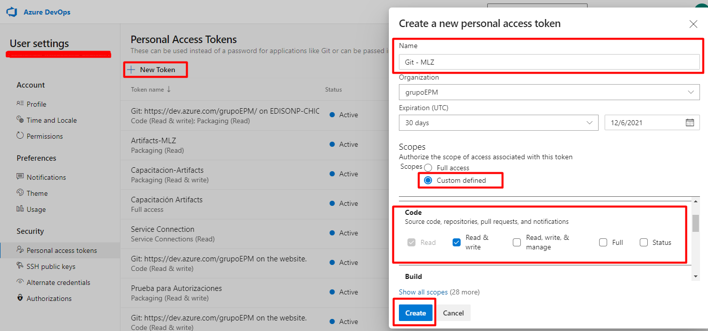
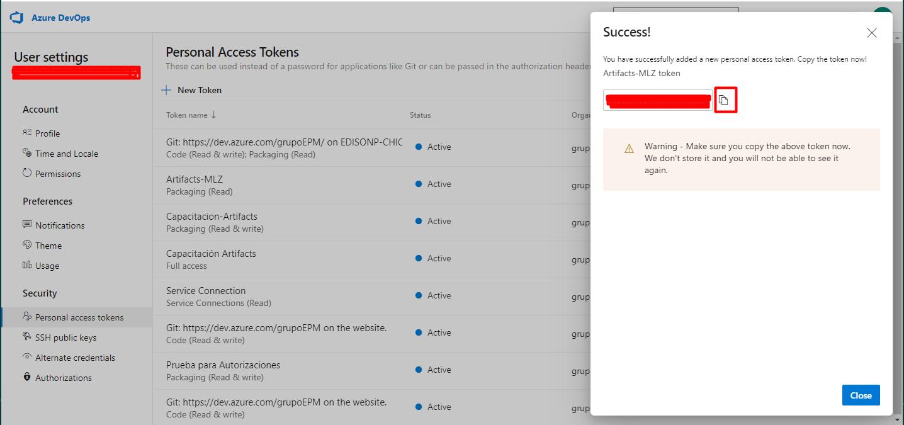

Los repositorios remotos le permiten compartir cambios desde o hacia su repositorio. Las ubicaciones remotas son generalmente un servidor de compilación, una máquina de miembros del equipo o una tienda centralizada como Github.com. Los repositorios remotos se clonan usando el comando `git clone <remote-url>` donde `<remote-url>` es la ubicación remota, generalmente una URL HTTPS o una conexión SSH, por ejemplo https://github.com/OcelotUproar/ocelite.git or git@github.com:/OcelotUproar/ocelite.git.  

## Tarea

Para este ejercicio, se requiere generar un token para realizar el logueo. Para esto, deberá de ingresar al proyecto de CapacitacionesEPM para generar el token y seguir las siguentes indicaciones:

- Diríjase a https://grupoepm.visualstudio.com/CapacitacionesEPM e ingrese al menú de las configuraciones

- Ahora el siguiente paso a seguir es crear el token. Entonces, deberá de seleccionar la opción New Token y para nombrarlo deberá de seguir el lineamiento GIT - Iniciales del nombre, por ejemplo:Si la usuaria se llama Milena López Zapata, su token deberá de llamarse: GIT - MLZ. Seleccionar en Scoopes la opción Custom defined, buscar la opción Code y seleccionar la opción **Read&Write**. Para generar el token seleccione por último el botón de crear:

- Después se abrirá una ventana al lado derecho de su pantalla, copie el token y péguelo en un sitio que sea seguro para usted (block de notas) Tenga en cuenta que este código por temas de seguridad solamente podrá obtenerlo por una vez y se necesitará para otro paso más adelante:

Una vez termine de generar el token, retorne a la consola de esta ventama. Tenemos un repositorio en una ubicación remota en https://grupoepm.visualstudio.com/CapacitacionesEPM/_git/Aprendiendo_Git. Usando `git clone`, clone el repositorio remoto. Cuando corra los comandos, le solucitará que ingrese el username corresponde al que usa en la compañía y el password es el token que generó anteriormente y estos datos se le solicitara cada vez que realice alguna transacción al repositorio remoto. Tenga en cuenta que una vez usted pegue el ese valor en el campo del password no se visualizará

## Tips

Cuando usa el comando `git clone`, se agregará automáticamente como un control remoto con el nombre de `origin` la ubicación desde la que está clonando.

Si desea agregar varios controles remotos a un repositorio local use el comando `git remote add <remote-name> <remote-url>` donde el `<remote-name>` es un nombre descriptivo y `<remote-url>` es la ubicación remota, por ejemplo `git remote add origin-epm https://github.com/OcelotUproar/ocelite.git`.

El nombre descriptivo le permite hacer referencia a la ubicación en otros comandos. Su repositorio local puede hacer referencia a varios repositorios remotos diferentes según su escenario.