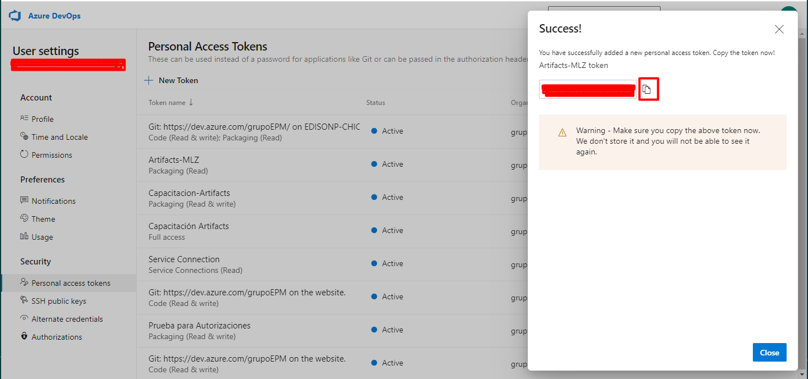

Cuando esté listo para compartir sus confirmaciones, debe enviarlas a un repositorio remoto a través de `git push`. Un flujo de trabajo típico de Git sería realizar varias confirmaciones pequeñas a medida que completa una tarea y la envía a un control remoto en puntos relevantes, como cuando la tarea está completa, para garantizar la sincronización del código dentro del equipo.

El comando `git push` va seguido de dos parámetros. El primer parámetro es el nombre descriptivo del repositorio remoto el cual es `origin`. El segundo parámetro es el nombre de la rama. De forma predeterminada, todos los repositorios de git tienen una rama `master` en la que se trabaja el código.

## Tarea

Automáticamente se creo un archivo llamado `staging_<random_number>.txt` dentro de la carpeta  `Aprendiendo_Git` y se confirmo.

Antes de continuar con el push, deberá de ingresar al proyecto de CapacitacionesEPM para generar el token. Para este paso debe de seguir las siguentes indicaciones:

- Diríjase a https://grupoepm.visualstudio.com/CapacitacionesEPM e ingrese al menú de las configuraciones

- Ahora el siguiente paso a seguir es crear el token. Entonces, deberá de seleccionar la opción New Token y para nombrarlo deberá de seguir el lineamiento GIT - Iniciales del nombre, por ejemplo:Si la usuaria se llama Milena López Zapata, su token deberá de llamarse: GIT - MLZ. Seleccionar en Scoopes la opción Custom defined, buscar la opción Code y seleccionar la opción **Read&Write**. Para generar el token seleccione por último el botón de crear:

- Después se abrirá una ventana al lado derecho de su pantalla, copie el token y péguelo en un sitio que sea seguro para usted (block de notas) Tenga en cuenta que este código por temas de seguridad solamente podrá obtenerlo por una vez.

Retorne a la consola de este ejercicio y use el comando `git push` para enviar la confirmación de la rama `master` al origen remoto que está en el proyecto de Capacitaciones. 

Una vez realizados estos pasos, en el momento que le socilite ingresar el password, deberá de pegar el token que creó en los pasos anteriores y presione enter. Cuando pegue la cadena, esta no se mostrara en la consola.

